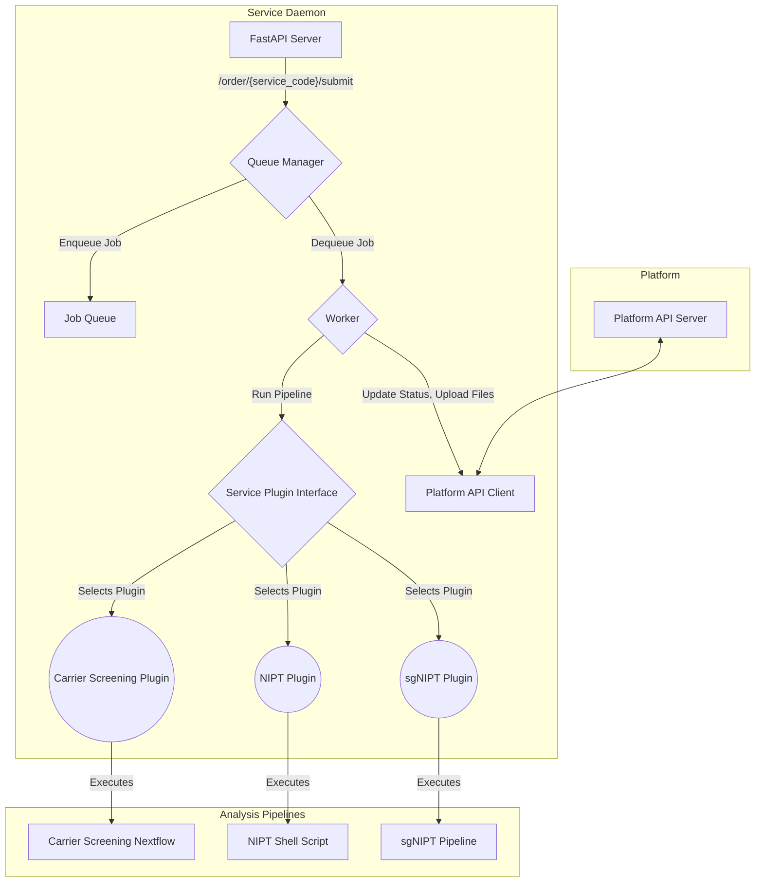

# Service-Daemon Architecture

## 1. 개요

본 문서는 기존의 `nipt-daemon`을 일반화하여, NIPT, Carrier Screening, sgNIPT 등 여러 유전체 분석 서비스를 플러그인 형태로 지원하는 범용 `service-daemon`의 아키텍처를 기술합니다. 이 설계의 핵심 목표는 **코드 재사용성 극대화**, **신규 서비스 추가 용이성**, 그리고 **안정적인 파이프라인 실행 관리**입니다.

## 2. 시스템 구성도



## 3. 핵심 설계 원칙

### 3.1. 플러그인 기반 아키텍처

- **서비스 추상화**: 모든 서비스(NIPT, Carrier Screening 등)는 `ServicePlugin`이라는 추상 기반 클래스(Abstract Base Class)를 상속받아 구현합니다. 이를 통해 각 서비스의 특화된 로직을 캡슐화하고, 데몬의 핵심 로직과 분리합니다.
- **동적 로딩**: 데몬 시작 시, `app/services` 디렉토리 내의 모든 플러그인을 동적으로 로딩하여 `service_code` (예: `carrier_screening`)를 키로 하는 딕셔너리에 등록합니다. 이를 통해 신규 서비스 추가 시 코드 수정이 최소화됩니다.

### 3.2. `ServicePlugin` 인터페이스

모든 플러그인은 다음의 메소드를 반드시 구현해야 합니다.

| 메소드 | 설명 |
| --- | --- |
| `prepare_inputs(order)` | 분석에 필요한 입력 파일(FASTQ 등)을 준비합니다. (예: S3 다운로드, 로컬 경로 확인) |
| `get_pipeline_command(order)` | 실행할 파이프라인의 전체 쉘 명령어를 생성하여 반환합니다. |
| `check_completion(order)` | 파이프라인의 성공적인 완료 여부를 확인합니다. (예: 특정 결과 파일 존재 여부) |
| `process_results(order)` | 완료 후 결과 처리 및 리포트 생성을 담당합니다. (예: Annotation, 리뷰 페이지 JSON 생성) |
| `get_output_files(order)` | 플랫폼에 업로드할 최종 결과 파일 목록을 반환합니다. |

### 3.3. 일반화된 `service-daemon` 핵심 로직

- **FastAPI 기반 API 서버 (`main.py`)**: `/order/{service_code}/submit` 엔드포인트를 통해 모든 서비스의 주문을 접수합니다. `service_code`를 통해 적절한 플러그인을 선택하여 작업을 큐에 추가합니다.
- **작업 큐 관리자 (`queue_manager.py`)**: `nipt-daemon`의 `asyncio.Queue`와 `Semaphore`를 그대로 활용하여, 모든 서비스의 작업을 단일 큐에서 안정적으로 관리하고 동시 실행 수를 제어합니다.
- **범용 실행기 (`runner.py`)**: 큐에서 작업을 가져와 선택된 서비스 플러그인의 `prepare_inputs`, `get_pipeline_command`, `check_completion` 메소드를 순차적으로 호출하여 파이프라인을 실행하고 모니터링합니다.
- **플랫폼 API 클라이언트 (`platform_client.py`)**: `nipt-daemon`의 `aws_client.py`를 일반화하여, 인증, 상태 업데이트, 파일 업로드 등 플랫폼과의 모든 통신을 담당합니다. API 경로와 페이로드에 `service_code`를 추가하여 여러 서비스를 구분합니다.

## 4. 디렉토리 구조

새로운 `service-daemon` 프로젝트의 디렉토리 구조는 다음과 같이 설계합니다.

```
/home/ubuntu/service_daemon/
├── app/
│   ├── __init__.py
│   ├── main.py             # FastAPI 애플리케이션 (API 엔드포인트)
│   ├── config.py           # 설정 관리 (환경변수 로드)
│   ├── models.py           # Pydantic 데이터 모델
│   ├── queue_manager.py    # 작업 큐 및 워커 관리
│   ├── runner.py           # 범용 파이프라인 실행 및 모니터링
│   ├── platform_client.py  # 플랫폼 API 연동 클라이언트
│   ├── services/           # 서비스 플러그인 디렉토리
│   │   ├── __init__.py
│   │   ├── base.py         # ServicePlugin 추상 기반 클래스
│   │   ├── carrier_screening.py # Carrier Screening 서비스 플러그인
│   │   └── nipt.py         # NIPT 서비스 플러그인 (기존 로직 이전)
│   └── static/             # 정적 파일 (대시보드 HTML 등)
├── data/
│   ├── templates/          # 리포트 템플릿 (서비스별 하위 디렉토리)
│   └── resources/          # Annotation용 리소스 (ClinVar, gnomAD 등)
├── Dockerfile
├── docker-compose.yml
├── requirements.txt
└── .env.example
```

## 5. Carrier Screening 서비스 구현 계획

`carrier_screening.py` 플러그인은 다음과 같이 구현됩니다.

1.  **`get_pipeline_command`**: `nextflow run /path/to/carrier-screening/bin/main.nf ...` 명령어를 생성합니다. 파라미터는 `order` 객체에서 동적으로 가져옵니다.
2.  **`check_completion`**: Nextflow 실행 완료 후 생성되는 `output_dir`의 `*_summary_report.json` 파일 존재 여부로 성공을 판단합니다.
3.  **`process_results`**: `carrier-screening/Genomics_Pipeline/phenotype_portal/main.py`의 Annotation 로직을 재사용하여 `*_summary_report.json`에 dbsnp, ClinVar, gnomAD 정보를 추가하고, 리뷰 페이지에 필요한 최종 JSON을 생성합니다.
4.  **`get_output_files`**: Annotation이 완료된 최종 JSON과 관련 이미지(IGV 스냅샷 등) 파일 경로를 반환하여 플랫폼에 업로드하도록 합니다.
